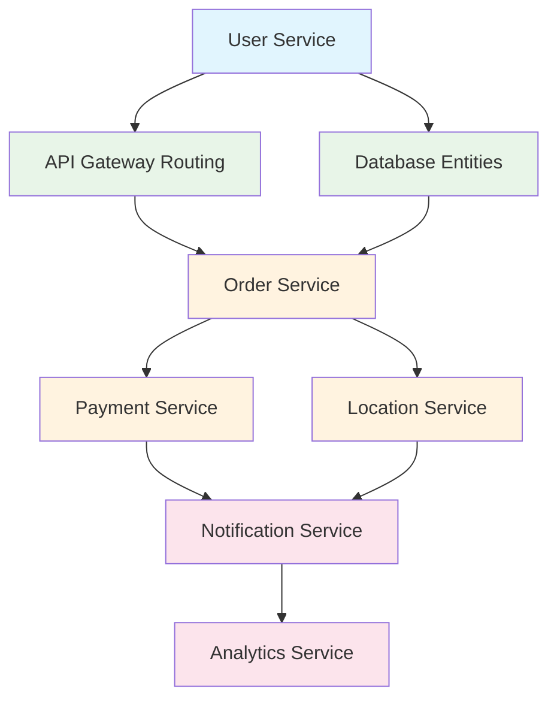

# 🧺 Laundry Platform

> End-to-end laundry service platform with microservices architecture connecting customers, laundry shops, and delivery partners in Qatar

## 📋 Overview

A comprehensive platform that bridges the gap between customers seeking laundry services and laundry shop owners in Qatar, featuring real-time order tracking, integrated payments, and seamless delivery management built with a scalable microservices architecture.

### 🎯 Core Features

- **Customer Mobile App** (Flutter): Shop discovery, order booking, real-time tracking
- **Shop Management PWA** (Angular): Order management, CRM, analytics, POS system
- **Microservices Backend**: Scalable, independent services for different business domains
- **API Gateway**: Single entry point with request routing and load balancing
- **Real-time Updates**: Live order status via WebSocket connections
- **Payment Integration**: Qatar-specific payment gateways + international options
- **Geolocation Services**: Smart shop discovery within 3km radius using PostGIS

## 🏗️ Microservices Architecture

### Monorepo Structure
```
laundry-platform/
├── apps/
│   ├── services/                    # 🎯 Microservices (NestJS)
│   │   ├── user-service/           # Port 3001 - Auth, Profile, Permissions
│   │   ├── order-service/          # Port 3002 - Order CRUD, Status Updates
│   │   ├── payment-service/        # Port 3003 - Transactions, Refunds
│   │   ├── notification-service/   # Port 3004 - Push, Email/SMS
│   │   ├── location-service/       # Port 3005 - Shop Discovery, Routing  
│   │   └── analytics-service/      # Port 3006 - Reporting, Business Intel
│   ├── gateways/
│   │   ├── api-gateway/           # Port 3000 - Main API Gateway
│   │   └── websocket-gateway/     # Real-time WebSocket connections
│   ├── frontend/                   # Angular 16 PWA (Port 4200)
│   ├── mobile/                     # Flutter Customer App
│   └── legacy-backend/             # Original backend (migration support)
├── packages/                       # Shared Libraries
│   ├── shared-types/              # TypeScript interfaces & types
│   ├── constants/                 # API endpoints, validation, Qatar config
│   ├── common/                    # Utilities, decorators, guards
│   ├── database/                  # Shared entities & migrations
│   └── messaging/                 # Inter-service communication
├── tools/
│   ├── docker/                    # Docker configurations
│   ├── scripts/                   # Development automation
│   └── database/                  # Database utilities
└── docs/                         # Documentation
```

### Tech Stack

| Component | Technology | Purpose |
|-----------|------------|---------|
| **Microservices** | NestJS + TypeScript | Independent, scalable services |
| **API Gateway** | NestJS + Microservices | Request routing & load balancing |
| **Communication** | Redis Pub/Sub | Inter-service messaging |
| **Database** | PostgreSQL + PostGIS | Primary storage + geospatial queries |
| **Caching** | Redis | Session management & caching |
| **Frontend** | Angular 16 + PWA | Shop management interface |
| **Mobile** | Flutter 3.x | Customer mobile application |
| **Auth** | JWT + Firebase Auth | Authentication & authorization |
| **Payments** | Stripe + Qatar Banks | Payment processing |
| **Maps** | Google Maps API | Location services |
| **Notifications** | Firebase FCM | Push notifications |

## 🚀 Quick Start

### Prerequisites

- **Node.js** 18+ ([Download](https://nodejs.org/))
- **PNPM** 8+ (Will be installed automatically)
- **Flutter** 3.10+ ([Install Guide](https://docs.flutter.dev/get-started/install))
- **Docker** & Docker Compose ([Install Guide](https://docs.docker.com/get-docker/))

### One-Command Setup

```bash
# Clone the repository
git clone https://github.com/yourusername/laundry-platform.git
cd laundry-platform

# Run automated setup
chmod +x tools/scripts/setup.sh
./tools/scripts/setup.sh
```

### Manual Setup

```bash
# Install dependencies
pnpm install

# Setup environment
cp .env.example .env
# Edit .env with your configuration

# Build shared packages
pnpm run build:packages

# Start database services
pnpm run db:up

# Start development servers
pnpm run dev:backend    # Backend API (Port 3000)
pnpm run dev:frontend   # Shop PWA (Port 4200)
pnpm run dev:mobile     # Flutter app
```

### Docker Development

```bash
# Start all services
pnpm run docker:dev

# Start specific services
docker-compose -f tools/docker/docker-compose.yml up postgres redis
```

## 📱 Applications

### Backend API (NestJS)
- **URL**: http://localhost:3000
- **Docs**: http://localhost:3000/api/docs
- **Features**: RESTful API, WebSocket, Authentication, File uploads

### Shop Management PWA (Angular)
- **URL**: http://localhost:4200
- **Features**: Order management, Analytics, POS, CRM
- **PWA**: Installable on mobile/desktop

### Customer Mobile App (Flutter)
- **Platform**: Android & iOS
- **Features**: Shop discovery, Order tracking, Payments
- **Development**: Hot reload enabled

## 🗄️ Database

### Development Databases
- **PostgreSQL**: localhost:5432 (Main database)
- **Redis**: localhost:6379 (Caching & sessions)
- **Adminer**: http://localhost:8080 (Database GUI)
- **Redis Commander**: http://localhost:8081 (Redis GUI)

### Connection Details
```bash
Database: laundry_db
Username: laundry_user
Password: [from .env file]
```

## 🛠️ Development

### Microservices Management

```bash
# Start all microservices
./tools/scripts/dev-microservices.sh start

# Stop all services
./tools/scripts/dev-microservices.sh stop

# Restart all services  
./tools/scripts/dev-microservices.sh restart

# Check service health
./tools/scripts/dev-microservices.sh health

# View all service logs
./tools/scripts/dev-microservices.sh logs
```

### Individual Service Management

```bash
# Start specific services
./tools/scripts/dev-microservices.sh start:user        # User Service
./tools/scripts/dev-microservices.sh start:order       # Order Service  
./tools/scripts/dev-microservices.sh start:payment     # Payment Service
./tools/scripts/dev-microservices.sh start:notification # Notification Service
./tools/scripts/dev-microservices.sh start:location    # Location Service
./tools/scripts/dev-microservices.sh start:analytics   # Analytics Service
./tools/scripts/dev-microservices.sh start:gateway     # API Gateway

# View specific service logs
./tools/scripts/dev-microservices.sh logs:user-service
./tools/scripts/dev-microservices.sh logs:api-gateway
```

### Building & Testing

```bash
# Build shared packages
pnpm run build:packages     # Build shared packages only
pnpm run build:services     # Build all microservices
pnpm run build:gateways     # Build API gateways
pnpm run build:all          # Build everything

# Testing
pnpm run test:all           # Run all tests
./tools/scripts/dev-microservices.sh test  # Test all services

# Linting
pnpm run lint:all           # Lint all code
```

### Frontend Development

```bash
# Angular PWA
pnpm run dev:frontend       # Start Angular dev server
pnpm --filter=frontend run build:prod  # Production build

# Flutter Mobile App  
pnpm run dev:mobile         # Start Flutter app
cd apps/mobile && flutter build apk    # Android build
```

### Database Management

```bash
# Start database services
pnpm run db:up              # Start PostgreSQL + Redis

# Database operations
pnpm run migration:generate  # Generate new migration
pnpm run migration:run      # Run pending migrations
```

### Code Organization

#### Shared Packages
- **shared-types**: TypeScript interfaces used across all services and clients
- **constants**: API endpoints, validation rules, Qatar-specific configuration
- **common**: Reusable utilities, decorators, guards for microservices
- **database**: Shared database entities and configurations
- **messaging**: Inter-service communication patterns and client utilities

#### Microservices Structure
```
apps/services/
├── user-service/           # Authentication & user management
│   ├── src/auth/          # JWT, OAuth, password management
│   ├── src/users/         # User CRUD operations
│   └── src/permissions/   # Role-based access control
├── order-service/         # Order processing & tracking
│   ├── src/orders/        # Order lifecycle management
│   ├── src/workflow/      # Status transitions & business rules
│   └── src/assignment/    # Delivery assignment logic
├── payment-service/       # Payment processing
│   ├── src/payments/      # Transaction processing
│   ├── src/refunds/       # Refund handling
│   └── src/billing/       # Invoice generation
├── notification-service/  # Messaging & notifications
│   ├── src/push/          # Push notifications
│   ├── src/email/         # Email templates & sending
│   └── src/sms/           # SMS integration
├── location-service/      # Geospatial & routing
│   ├── src/discovery/     # Shop discovery algorithms
│   ├── src/routing/       # Delivery route optimization
│   └── src/geocoding/     # Address validation
└── analytics-service/     # Reporting & business intelligence
    ├── src/reports/       # Report generation
    ├── src/dashboards/    # Dashboard data aggregation
    └── src/kpis/          # Key performance indicators
```

#### API Gateway Structure
```
apps/gateways/api-gateway/
├── src/auth/              # Authentication middleware
├── src/routing/           # Service routing logic
├── src/rate-limiting/     # Rate limiting & throttling
└── src/monitoring/        # Health checks & metrics
```

## 🌍 Qatar Market Specific

### Localization
- **Currency**: QAR (Qatari Riyal)
- **Timezone**: Asia/Qatar
- **Languages**: English, Arabic
- **Phone Format**: +974XXXXXXXX

### Payment Integration
- **Local Banks**: QIB, CBQ, Doha Bank, Ahli Bank
- **Digital Wallets**: Fawry Pay, Ooredoo Money
- **International**: Stripe (Cards, Apple Pay, Google Pay)

### Delivery Zones
- **Zone 1**: Central Doha (5 QAR, 5km)
- **Zone 2**: Greater Doha (10 QAR, 15km)
- **Zone 3**: Extended Areas (15 QAR, 25km)

## 🔧 Configuration

### Environment Variables
```bash
# Database
DB_HOST=localhost
DB_PORT=5432
DB_USERNAME=laundry_user
DB_PASSWORD=your_password
DB_NAME=laundry_db

# Redis
REDIS_HOST=localhost
REDIS_PORT=6379

# JWT
JWT_SECRET=your_secret_key
JWT_EXPIRES_IN=7d

# Google Maps
GOOGLE_MAPS_API_KEY=your_api_key

# Firebase
FIREBASE_PROJECT_ID=your_project_id
FIREBASE_PRIVATE_KEY=your_private_key
```

### API Documentation
Interactive API documentation is available at `/api/docs` when running the backend in development mode.

## 📚 Documentation

- [API Documentation](docs/api/) - Detailed API reference
- [Database Schema](docs/database/) - Database design & migrations
- [Deployment Guide](docs/deployment/) - Production deployment
- [Architecture Overview](docs/architecture/) - System design

## 🚢 Deployment

### Production Build
```bash
# Build all applications
pnpm run build:all

# Backend (NestJS)
cd apps/backend && npm run build

# Frontend (Angular PWA)
cd apps/frontend && npm run build:prod

# Mobile (Flutter)
cd apps/mobile && flutter build apk --release
```

### Docker Production
```bash
docker-compose -f tools/docker/docker-compose.prod.yml up -d
```

## 🧪 Testing

```bash
# Test all microservices
./tools/scripts/dev-microservices.sh test

# Test individual services
pnpm --filter=user-service run test
pnpm --filter=order-service run test:cov    # With coverage

# Test frontend applications
pnpm --filter=frontend run test:ci
cd apps/mobile && flutter test

# End-to-end testing
pnpm --filter=api-gateway run test:e2e

# Integration testing across services
./tools/scripts/test-integration.sh
```

## 🏗️ Microservices Benefits

### **✅ What This Architecture Provides:**

- **🔄 Independent Scaling**: Scale each service based on demand (e.g., scale payment service during peak hours)
- **🛡️ Fault Isolation**: If notification service fails, orders can still be processed
- **👥 Team Autonomy**: Different teams can own and deploy services independently
- **🚀 Independent Deployment**: Deploy user service without affecting order processing
- **💾 Database Per Service**: Each service can optimize its data storage needs
- **🔧 Technology Flexibility**: Use different technologies per service if needed
- **📈 Easy Monitoring**: Service-specific metrics, logging, and alerting
- **🔄 Event-Driven Architecture**: Async communication for better performance

### **🎯 Service Responsibilities:**

| Service | Port | Responsibilities |
|---------|------|------------------|
| **API Gateway** | 3000 | Request routing, authentication, rate limiting |
| **User Service** | 3001 | Authentication, user profiles, permissions |
| **Order Service** | 3002 | Order lifecycle, status tracking, workflow |
| **Payment Service** | 3003 | Payment processing, refunds, billing |
| **Notification Service** | 3004 | Push notifications, email, SMS |
| **Location Service** | 3005 | Shop discovery, routing, geospatial queries |
| **Analytics Service** | 3006 | Reporting, dashboards, business intelligence |

## 🔄 Migration Strategy

Since you have an existing backend (`legacy-backend`), you can:

1. **Keep existing backend running** alongside new microservices
2. **Gradually migrate features** from monolith to microservices
3. **Use API Gateway** to route between new and legacy services
4. **Retire legacy components** as features are fully migrated

This provides a **zero-downtime migration path** with gradual feature migration.

## 🎯 Current Implementation Status

### ✅ **Completed Infrastructure:**
- [x] Monorepo setup with PNPM workspaces
- [x] 6 microservices scaffolded with NestJS
- [x] API Gateway created and configured
- [x] Angular PWA frontend structure
- [x] Flutter mobile app structure  
- [x] Docker configuration for all services
- [x] Development scripts for service management
- [x] Shared TypeScript packages (types, constants, messaging)
- [x] Inter-service communication patterns
- [x] Development workflow automation

### 🔄 **In Progress:**
- [ ] Database entities and migrations
- [ ] Authentication implementation (JWT + Firebase)
- [ ] Service-to-service communication
- [ ] API Gateway routing logic
- [ ] Basic CRUD operations per service

### 🎯 **Next Steps (Priority Order):**
1. **User Service**: Implement authentication, JWT tokens, user management
2. **Database Layer**: Create shared entities, migrations, repository patterns
3. **API Gateway**: Implement request routing and authentication middleware
4. **Order Service**: Order creation, status updates, workflow management
5. **Payment Service**: Stripe integration, Qatar payment gateways
6. **Location Service**: PostGIS shop discovery, geospatial queries
7. **Frontend Integration**: Connect Angular PWA to API Gateway
8. **Mobile Integration**: Flutter API client and authentication flow
9. **Real-time Features**: WebSocket implementation for live updates
10. **Production Deployment**: CI/CD, monitoring, scaling configurations

## 📊 Service Development Priority



**Legend**: 🔵 Phase 1 (Immediate) | 🟢 Phase 2 (Core) | 🟠 Phase 3 (Enhanced) | 🔴 Phase 4 (Advanced)

## 🤝 Contributing

1. Fork the repository
2. Create your feature branch (`git checkout -b feature/amazing-feature`)
3. Commit your changes (`git commit -m 'Add amazing feature'`)
4. Push to the branch (`git push origin feature/amazing-feature`)
5. Open a Pull Request

### Development Guidelines
- Follow TypeScript strict mode
- Use conventional commits for clear history
- Add tests for new features and services
- Update documentation and README
- Ensure all lints pass across all packages
- Test microservice integration
- Follow microservices best practices

### Working with Microservices
- Test service independence (can each service run alone?)
- Ensure proper error handling between services
- Document service APIs in OpenAPI/Swagger
- Monitor service health and performance
- Use semantic versioning for service releases

## 📄 License

This project is licensed under the MIT License - see the [LICENSE](LICENSE) file for details.

## 📞 Support

- **Documentation**: [docs/](docs/) - Comprehensive guides and API references
- **Issues**: [GitHub Issues](https://github.com/yourusername/laundry-platform/issues) - Bug reports and feature requests
- **Discussions**: [GitHub Discussions](https://github.com/yourusername/laundry-platform/discussions) - Questions and community support
- **Email**: support@laundryplatform.qa - Direct support contact

### Architecture Support
- **Microservices**: Each service has its own README with specific documentation
- **API Gateway**: Centralized API documentation at `/api/docs`
- **Development**: Use health checks and monitoring for debugging
- **Deployment**: Docker Compose and Kubernetes configurations provided

---

**Built with ❤️ for the Qatar market** 🇶🇦

*Scalable • Reliable • Production-Ready*